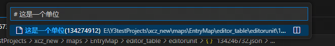
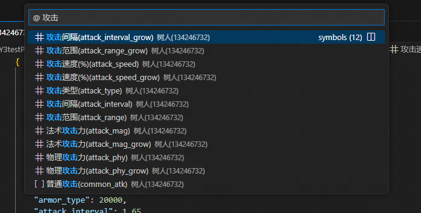

# Y3开发助手

## 初始化项目（给新建的地图使用，老地图勿用！）：

1. 按 `F1` 打开命令列表，使用命令 `Y3:初始化开发环境`
2. 选择地图路径
3. 完成！

## 修改并导入物编

初始化后，你的项目中会生成 `resource\editor_table` 文件夹，你可以修改这些CSV文件来生成物编。

之后使用命令 `Y3:导入物编数据（CSV）` 即可将这些物编写入地图。

> 如果是老地图，请使用命令 `Y3:生成物编模板（CSV）` 来生成模板文件

> 推荐和[Edit csv](https://marketplace.visualstudio.com/items?itemName=janisdd.vscode-edit-csv)插件配合使用，以便在Visual Code内编辑CSV表格，无需打开新的窗口

> 你可以通过 `Y3-Helper.CSVPath` 设置修改这些CSV文件的路径

## 在vscode内查看搜索和编辑Y3项目的物编数据

在初始化项目后，你可以在explorer中的大纲(OUTLINE)和Y3开发助手:物编数据中查看Y3项目的物编数据。
你可以看到物编数据的Json和其字段名的含义，点击你想要编辑的属性，即可跳转到对应字段。
你可以在此直接编辑物编数据，因为vscode对Json文件的语法检查能力，相比在CSV表格修改数据后导入的方式，你不再用担心语法或格式编写错误。
在vscode中快捷键ctrl+T可以搜索对象。

你需要以名称搜索某一个物编数据可以这样：
```
# 这是一个单位
```


点击打开保存此物编数据的Json后，按下快捷键ctrl+T，你可以这样在此Json中搜索你要编辑的属性
```
@ 攻击
```

